# Data Warehouse ER Diagram

Star schema for the University Management System data warehouse.  
Source: 34 CSV exports from the university LMS.

```mermaid
erDiagram

    %% ─── REFERENCE DIMENSIONS ──────────────────────────────────────────────

    dim_faculty {
        int faculty_key PK
        string name
        string name_kh
        string short_letter
        string color
        datetime created_at
    }

    dim_department {
        int department_key PK
        string name
        string name_kh
        string short_letter
        int faculty_key FK
        string faculty_name
        datetime created_at
    }

    dim_major {
        int major_key PK
        string name
        string description
        int department_key FK
        string department_name
        bool allow_registration
        datetime created_at
    }

    %% ─── ACADEMIC CALENDAR ──────────────────────────────────────────────────

    dim_date {
        date date_key PK
        int year
        int month
        string month_name
        int quarter
        int day_of_week
        string day_name
        int week_of_year
        bool is_weekend
        string academic_year_label
        bool is_holiday
        string holiday_name
    }

    dim_holiday {
        int holiday_key PK
        string name
        date date_key FK
        int type_code
        string type_label
        bool is_active
        datetime created_at
    }

    dim_semester {
        int semester_key PK
        int semester_number
        int year_level
        string academic_year
        date start_date
        date end_date
        string final_period
        int major_key FK
        int number_of_months
        int start_month
    }

    %% ─── PEOPLE DIMENSIONS ──────────────────────────────────────────────────

    dim_student {
        int student_key PK
        string student_id
        int batch
        int year_level
        string first_name
        string last_name
        string full_name
        string first_name_kh
        string last_name_kh
        string full_name_kh
        string gender
        date date_of_birth
        int age
        string place_of_birth
        string phone_number
        string email
        int status_code
        string status_label
        string shift_label
        bool is_scholarship
        int major_key FK
        string major_name
        datetime created_at
    }

    dim_teacher {
        int teacher_key PK
        string title
        string first_name
        string last_name
        string full_name
        string first_name_kh
        string last_name_kh
        string gender
        date start_date
        string qualification
        string room
        string office_day
        string office_time
        string phone_number
        string email
        float teaching_rate
        int department_key FK
        string department_name
        bool is_active
    }

    dim_user {
        int user_key PK
        string username
        int user_type_code
        string user_type_label
        int account_id
        string photo
        datetime created_at
    }

    %% ─── CURRICULUM DIMENSIONS ──────────────────────────────────────────────

    dim_course {
        int course_key PK
        string code
        string name
        string name_kh
        string description
        int credit
        int department_key FK
        string department_name
        int semester_number
        int year_level
        bool is_active
    }

    dim_course_learning_outcome {
        int clo_key PK
        int course_key FK
        string title
        string description
        int learning_domain
        int cognitive_affective_psychomotor
    }

    dim_section {
        int section_key PK
        int course_key FK
        string title
        string lesson_learning_outcome
        string description
        int clo_key FK
    }

    %% ─── SCHEDULING DIMENSIONS ──────────────────────────────────────────────

    dim_class {
        int class_key PK
        string name
        int type_code
        string room
        int semester_key FK
        string academic_year
        int semester_number
        date semester_start_date
        date semester_end_date
        int major_key FK
        string major_name
        int year_level
        bool is_active
    }

    dim_schedule {
        int schedule_key PK
        int course_key FK
        string course_name
        int teacher_key FK
        string teacher_name
        int class_key FK
        string class_name
        float teaching_rate_hours
        bool is_online
        int status
    }

    dim_schedule_time {
        int schedule_time_key PK
        int schedule_key FK
        time start_time
        time end_time
        string room
        string label
        int day_of_week
        string day_name
        float amount_in_hour
        bool is_confirmed
    }

    dim_evaluation_question {
        int evaluation_key PK
        int question_no
        string question_text
        int type_code
        string type_label
        int department_key FK
        bool is_active
    }

    %% ─── BRIDGE TABLES ──────────────────────────────────────────────────────

    bridge_teacher_course {
        int teacher_key FK
        int course_key FK
    }

    bridge_major_course {
        int major_key FK
        int course_key FK
    }

    %% ─── FACT TABLES ────────────────────────────────────────────────────────

    fact_enrollment {
        int enrollment_key PK
        int student_key FK
        int schedule_key FK
        int course_key FK
        int teacher_key FK
        int class_key FK
        int semester_key FK
        date enrollment_date_key FK
        float score_attendance
        float score_research
        float score_quiz
        float score_midterm
        float score_final
        float total_score
        string letter_grade
        float gpa_points
        int attendance_present
        int attendance_late
        int attendance_absent
        int attendance_total_sessions
        float attendance_rate_pct
        string note
    }

    fact_attendance {
        int attendance_key PK
        int student_key FK
        int user_key FK
        int schedule_time_key FK
        int schedule_key FK
        int course_key FK
        int teacher_key FK
        int class_key FK
        date check_in_date_key FK
        string check_in_time
        string check_out_time
        int check_in_status_code
        string check_in_status_label
        float check_out_status_code
        string check_out_status_label
        float duration_hours
        int day_of_week
        string day_name
        string reason
    }

    fact_grade {
        int grade_key PK
        int student_key FK
        int semester_key FK
        date semester_date_key FK
        float gpa
        int total_credit
        int earned_credit
        int cumulative_earned_credit
        float credit_completion_rate
        string remarks
    }

    fact_evaluation_rating {
        int eval_rating_key PK
        int enrollment_key FK
        int student_key FK
        int teacher_key FK
        int course_key FK
        int evaluation_key FK
        int semester_key FK
        date eval_date_key FK
        float rate
        int eval_type_code
        string eval_type_label
    }

    fact_evaluation_text {
        int eval_text_key PK
        int enrollment_key FK
        int student_key FK
        int teacher_key FK
        int evaluation_key FK
        string response_text
        int eval_type_code
        string eval_type_label
    }

    fact_permission {
        int permission_schedule_key PK
        int permission_key
        int student_key FK
        int user_key FK
        int schedule_time_key FK
        date permission_date_key FK
        int status_code
        string status_label
        string reason
        bool has_attachment
    }

    fact_makeup_class {
        int makeup_key PK
        int schedule_key FK
        int course_key FK
        int teacher_key FK
        int class_key FK
        date makeup_date_key FK
        time start_time
        time end_time
        float duration_hours
    }

    %% ─── RELATIONSHIPS ──────────────────────────────────────────────────────

    %% Reference hierarchy
    dim_faculty         ||--o{ dim_department          : "has"
    dim_department      ||--o{ dim_major               : "has"
    dim_department      ||--o{ dim_teacher             : "employs"
    dim_department      ||--o{ dim_course              : "owns"
    dim_department      ||--o{ dim_evaluation_question : "defines"
    dim_major           ||--o{ dim_semester            : "runs"
    dim_major           ||--o{ dim_student             : "enrolls"
    dim_major           ||--o{ dim_class               : "has"

    %% Calendar
    dim_date            ||--o{ dim_holiday             : "marks"

    %% Curriculum
    dim_course          ||--o{ dim_course_learning_outcome : "has"
    dim_course          ||--o{ dim_section             : "has"
    dim_course_learning_outcome ||--o{ dim_section     : "referenced by"

    %% Bridges
    dim_teacher         ||--o{ bridge_teacher_course   : "qualified for"
    dim_course          ||--o{ bridge_teacher_course   : "taught by"
    dim_major           ||--o{ bridge_major_course     : "requires"
    dim_course          ||--o{ bridge_major_course     : "in"

    %% Scheduling chain
    dim_semester        ||--o{ dim_class               : "defines"
    dim_class           ||--o{ dim_schedule            : "has"
    dim_teacher         ||--o{ dim_schedule            : "delivers"
    dim_course          ||--o{ dim_schedule            : "delivered via"
    dim_schedule        ||--o{ dim_schedule_time       : "has slots"

    %% Fact: Enrollment
    dim_student         ||--o{ fact_enrollment         : "enrolled in"
    dim_schedule        ||--o{ fact_enrollment         : "has enrollments"
    dim_course          ||--o{ fact_enrollment         : "delivered to"
    dim_teacher         ||--o{ fact_enrollment         : "teaches"
    dim_class           ||--o{ fact_enrollment         : "grouped in"
    dim_semester        ||--o{ fact_enrollment         : "in"
    dim_date            ||--o{ fact_enrollment         : "started on"

    %% Fact: Attendance
    dim_student         ||--o{ fact_attendance         : "checks in"
    dim_user            ||--o{ fact_attendance         : "via account"
    dim_schedule_time   ||--o{ fact_attendance         : "for session"
    dim_schedule        ||--o{ fact_attendance         : "for schedule"
    dim_course          ||--o{ fact_attendance         : "during"
    dim_teacher         ||--o{ fact_attendance         : "teacher"
    dim_class           ||--o{ fact_attendance         : "class"
    dim_date            ||--o{ fact_attendance         : "on date"

    %% Fact: Grade
    dim_student         ||--o{ fact_grade              : "earns"
    dim_semester        ||--o{ fact_grade              : "in"
    dim_date            ||--o{ fact_grade              : "as of"

    %% Fact: Evaluation Rating
    fact_enrollment     ||--o{ fact_evaluation_rating  : "rated in"
    dim_student         ||--o{ fact_evaluation_rating  : "rates"
    dim_teacher         ||--o{ fact_evaluation_rating  : "evaluated"
    dim_course          ||--o{ fact_evaluation_rating  : "for"
    dim_evaluation_question ||--o{ fact_evaluation_rating : "answered"
    dim_semester        ||--o{ fact_evaluation_rating  : "in"
    dim_date            ||--o{ fact_evaluation_rating  : "on"

    %% Fact: Evaluation Text
    fact_enrollment     ||--o{ fact_evaluation_text    : "feedback from"
    dim_student         ||--o{ fact_evaluation_text    : "written by"
    dim_teacher         ||--o{ fact_evaluation_text    : "about"
    dim_evaluation_question ||--o{ fact_evaluation_text : "for"

    %% Fact: Permission
    dim_student         ||--o{ fact_permission         : "requests"
    dim_user            ||--o{ fact_permission         : "via"
    dim_schedule_time   ||--o{ fact_permission         : "covers session"
    dim_date            ||--o{ fact_permission         : "on date"

    %% Fact: Makeup Class
    dim_schedule        ||--o{ fact_makeup_class       : "compensated by"
    dim_course          ||--o{ fact_makeup_class       : "for course"
    dim_teacher         ||--o{ fact_makeup_class       : "taught by"
    dim_class           ||--o{ fact_makeup_class       : "for class"
    dim_date            ||--o{ fact_makeup_class       : "on date"
```

---

## Warehouse Summary

| Layer | Count | Tables |
|---|---|---|
| Reference dims | 3 | dim_faculty, dim_department, dim_major |
| Calendar dims | 2 | dim_date, dim_holiday |
| People dims | 3 | dim_student, dim_teacher, dim_user |
| Curriculum dims | 3 | dim_course, dim_course_learning_outcome, dim_section |
| Scheduling dims | 4 | dim_semester, dim_class, dim_schedule, dim_schedule_time |
| Other dims | 1 | dim_evaluation_question |
| Bridge tables | 2 | bridge_teacher_course, bridge_major_course |
| Fact tables | 7 | fact_enrollment, fact_attendance, fact_grade, fact_evaluation_rating, fact_evaluation_text, fact_permission, fact_makeup_class |
| **Total** | **25** | |

## Key Grains

| Fact | Grain |
|---|---|
| fact_enrollment | 1 row per student per course offering (schedule) |
| fact_attendance | 1 row per student check-in event |
| fact_grade | 1 row per student per semester |
| fact_evaluation_rating | 1 row per student rating answer per evaluation question |
| fact_evaluation_text | 1 row per student text answer per evaluation question |
| fact_permission | 1 row per permission request per class session it covers |
| fact_makeup_class | 1 row per makeup session scheduled |
